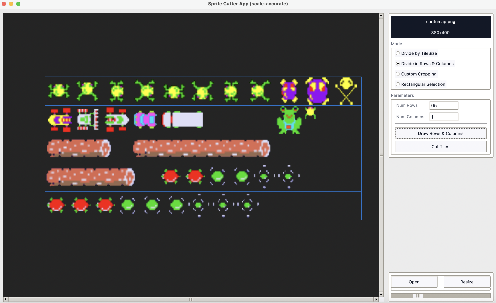

  

<h1 align="center">OlivisionWorks</h1>

<em>Tools, editors, and experiments built to power visual storytelling, sprites, and animation.</em>

---

<h2 align="center">About</h2>

OlivisionWorks is my personal creative engineering lab —  
a collection of tools and prototypes for sprite slicing, animation, and visual design.  
Each subfolder holds a small focused project: a GUI tool, script, or concept built for practical visual workflows.

  

---

### Projects

| Project | Description | Status |
|----------|--------------|--------|
| [**Spritesheet Cutter App**](./OlivisionWorks/spritesheet-cutter-app) | Slice and export sprite sheets by tile size or grid layout. | Active |
| **Palette Editor** | Manage and generate cohesive color palettes for pixel art and UI work. | Planned |
| **Tilemap Lab** | Simple tilemap visualizer for testing sprite alignment and animation loops. | In Progress |

---
### Spritesheet Cutter App Gui 

  

###  Tech Stack
- **Python** — Tkinter, Pillow, PyGame experiments  
- **Design** — Aseprite, Figma  
- **Future** — Web-based versions using React + Canvas  

---

### Vision
To make small, modular tools that empower visual creators —  
bridging **engineering precision** with **artistic expression**.

---

  

  

<em>From sprites to motion — building the invisible tools behind visible worlds.</em>

  

